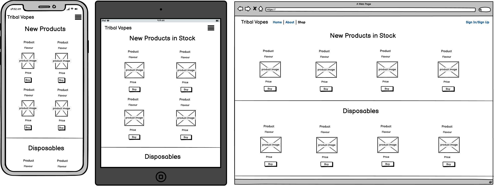

# Tribal Vapes Planning

## Purpose of the project
The purpose of this project is to design and develop a static website based around just HTML and CSS, which displays both how a website is structured using different html elements as well as how a page is styled with css componants.

----
## User Stories
As a customer I would like to see reviews/feedback from other customers so I can see how other people have liked the service and products sold.

As a customer I would like to read about the company so I can find out about the company with how they express their business and how they help expand their user friendly expierience.

As a customer I need to be able to see a wide range of products that the company sells so I can decide a choice from multi different brands/flavours and different rechargables.

----
## Features
Features ascross all pages:
* Navigation bar to access the different pages.
* Sign up/Sign in button.
* Collapsable nav bar on small devices.
* Links in the footer to different social media sites.

Landing page features:
* Jumbotron displaying a welcome promotion
* Recommended items with a button that goes to the product page.
* Review section with feedback from previous users,

About page features:
* Describing what Tribal Vapes is about.
* Talk about the ceo of the company.
* Read about three team leaders within the company.

Product page features:
* View different brands and products such as:
    * New products
    * Disposables
    * E-cigarettes
    * Liquids

----
## Future Features
Future plans for features to be added to the website is a shopping basket system, account system with a wallet/payment system, a contact section where customers can leave feedback or ask any questions. A change that could be made is a more depth shopping page that would extend into sub-pages based on the type of product.

----
## Typography & Color Scheme
The font that will be used throughout the web pages is [ubuntu](https://fonts.google.com/specimen/Ubuntu?query=ubuntu) with different font weights for a regular, bold and light font style. The font colour is going to be an offset white.

The background colour scheme that will be set for the pages on the website is going to be an outer wrapper for the page that will be a light blend of grey and dark blue with an inner wrapper that is going to be a light charcoal colour.

An additional element is with images used within the website will have a thin solid black border around the image which will add a bit of extra style to the images.

----
## Wireframes
### Index Page

### About Page

### Shop Page
