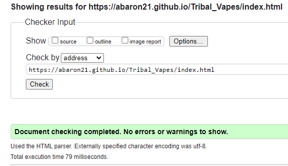
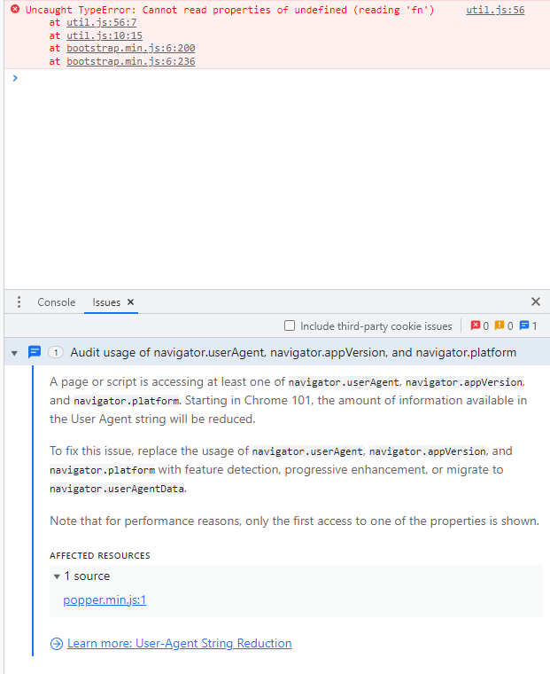

# Tribal Vapes Production

## Technology Used
With this project being to build a static website only a few technologies will/have been used in the planning and production of the website. Starting with planning stage, there was only one piece of technology used which was a software called 'Balsamiq Wireframes' and this was used to create the wireframe plans for the three web pages within the website.

Moving to the production stage, there was two main technologies as well as an additional sub-technology which has been for a few different elements throughout the website. Beginning with the main ones which are GitHub and GitPod, GitPod is a cloud based IDE that has been where all of code for both the HTML and CSS components have been created, GitHub is the cloud based software that has been used as the version control for the project but also where the project has been saved to. Finally the additional technology which is Bootstrap, this technology was used to help with the basic structuring and styling of the website as well as helping with responiveness and a collapsable navigation bar.

----
## Testing
### Code Validation

### Bugs
One bug that occured during the production was whilst the implementation of the collapsable navigation bar was being added and the error shown below kept showing in the chrome dev tool.

After looking over code, the reason for this bug to appear was the simple solution that versions for bootstrap that had been added were all different so resolving the situation was just a case of making sure all the bootstrap scripts/links were all the same version.

### Screens
All web pages within the website have been tested to make sure that they are responsive for all screen sizes starting at mobile devices and increasing upwards to tablets, laptops and finally desktops being the typically largest screen expected for a browser window.

----
## Deployment
As this project is only a small website production consisting of three web pages with just HTML and CSS, the website will be deployed through GitHub's GitPages as there's hardly any functionality behind the website so GitPages will be able to deploy the website and it'll be stable to view each web page with navigating between them and seeing the content of each page.