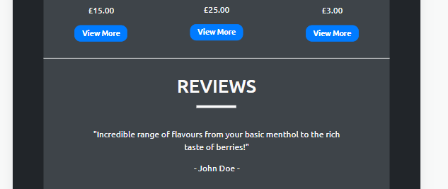

# Tribal Vapes

## Purpose of the project
The purpose of this project is to design and develop a static website based around just HTML and CSS, which displays both how a website is structured using different html elements as well as how a page is styled with css componants.

----
## User Stories
As a customer I would like to see reviews/feedback from other customers so I can see how other people have liked the service and products sold.

As a customer I would like to read about the company so I can find out about the company with how they express their business and how they help expand their user friendly expierience.

As a customer I need to be able to see a wide range of products that the company sells so I can decide a choice from multi different brands/flavours and different rechargables.

----
## Features
Features ascross all pages:
* Navigation bar to access the different pages.
* Sign up/Sign in button.
* Collapsable nav bar on small devices.
* Links in the footer to different social media sites.

Landing page features:
* Jumbotron displaying a welcome promotion
* Recommended items with a button that goes to the product page.
* Review section with feedback from previous users,

About page features:
* Describing what Tribal Vapes is about.
* Talk about the ceo of the company.
* Read about three team leaders within the company.

Product page features:
* View different brands and products such as:
    * New products
    * Disposables
    * E-cigarettes
    * Liquids

----
## Future Features
Future plans for features to be added to the website is a shopping basket system, account system with a wallet/payment system, a contact section where customers can leave feedback or ask any questions. A change that could be made is a more depth shopping page that would extend into sub-pages based on the type of product.

----
## Typography & Color Scheme
The font that will be used throughout the web pages is [ubuntu](https://fonts.google.com/specimen/Ubuntu?query=ubuntu) with different font weights for a regular, bold and light font style. The font colour is going to be an offset white.

The background colour scheme that will be set for the pages on the website is going to be an outer wrapper for the page that will be a light blend of grey and dark blue with an inner wrapper that is going to be a light charcoal colour.

An additional element is with images used within the website will have a thin solid black border around the image which will add a bit of extra style to the images.

----
## Wireframes
### Index Page

### About Page

### Shop Page

## Technology Used
Balsamiq Wireframes - Used to build/create the basic visual template for the website across all screen sizes.

GitPod - Cloud based IDE used to create and build the code for the website with HTML & CSS.

HTML - Programming language used to build the structure of the website/web pages by the use of elements and different components.

CSS - The styling for the website, used to make the web pages more visually appealing.

Bootstrap - An external libary used that aims to focus on the resposiveness of the website.

GitHub - A cloud based storage used as the version control for the production by committing and pushing at various stages throughout the development.

GitPages - Used to deploy the final development.

----
# Testing
## Code Validation
Landing Page

About Page

Shop Page

## User Stories

### Signing up to Tribal Vapes:
1. Load the website
2. Click on the sign up button in the promotion section/Click the Sign in button in the navigation bar, (if signing up through the nav bar) Click the text that says 'Don't have an account'
3. Enter your email and a password then confirm your password and submit.

### Seeing reviews other customers have mentioned:
1. Load the website
2. Scroll to the bottom of the landing page.

### Reading about the company:
1. Locate and click "About" on the nav bar
2. Scroll slightly down to read about the Ceo
3. Scroll further to read about the team and their responsibilities.

### Viewing the products from Tribal Vapes:
1. Find and click "Products" within the nav bar
2. Scroll through the page to view all the different products.

### Bugs
One bug that occured during the production was whilst the implementation of the collapsable navigation bar was being added and the error shown below kept showing in the chrome dev tool.

After looking over code, the reason for this bug to appear was the simple solution that versions for bootstrap that had been added were all different so resolving the situation was just a case of making sure all the bootstrap scripts/links were all the same version.

### Screens
All web pages within the website have been tested to make sure that they are responsive for all screen sizes starting at mobile devices and increasing upwards to tablets, laptops and finally desktops being the typically largest screen expected for a browser window.

----
## Deployment
Two versions on deployment:
* GitPod - used throughout the development by typing 'python3 -m http.server' in the terminal which gives a prompt to open in a new tab within the browser.
* GitPages - the final deployment of the website which makes it accesible to the public.

----
## Image Sources
### About Images
[woman](https://www.pexels.com/photo/woman-in-black-scoop-neck-shirt-smiling-38554/)

[man-1](https://en.wikipedia.org/wiki/Man#/media/File:Outdoors-man-portrait_(cropped).jpg)

[man-2](https://timesofindia.indiatimes.com/life-style/relationships/web-stories/traits-of-a-high-quality-man/photostory/83890812.cms)

[man-3](https://www.glamour.com/story/10-hot-guys-who-just-look-bett)

### Product Images
[vaporfi](https://www.vaporfi.com/media/catalog/product/b/a/base_watermelonwave.jpg)

[12-monkeys](https://d1q4q7ketxgxfn.cloudfront.net/media/catalog/product/cache/312af16b4230f9639b105af4a9030f8d/1/2/12-monkeys-hakuna.jpg)

[ivg](https://vapable.com/wp-content/uploads/2021/06/IVG-Product-Image-30ml-sweett.jpg)

[zeus-juice](http://cdn.ecommercedns.uk/files/9/239619/7/12117137/zeus-juice-typhon-shortfill.jpg)

[drag](https://cdn.shopify.com/s/files/1/1975/5513/products/voopoo-drag-s-pro-kit-sapphire-blue_800x800_crop_center.jpg?v=1630412160)

[twister](https://cdn.shopify.com/s/files/1/1783/8285/products/kit-freemax-twister-kit-metal-edition-free-bulb-glass-blue-7207647608921_1000x_4279d927-3972-496e-b5d1-67c55b4dffb1_700x700.jpg?v=1602749194)

[aspire-pockex](https://www.ecigarettedirect.co.uk/media/catalog/product/cache/2/image/9df78eab33525d08d6e5fb8d27136e95/a/s/aspire-pockex-temp-grey-gradient.jpg)

[eleaf](https://im9.cz/iRft/198/87/3209587198--400x400.jpg)

[crystal-bar](https://cdn.shopify.com/s/files/1/0241/2241/products/Banana_Ice_3ef8b96d-bb0d-4a06-a527-33718461c958_600x.png?v=1649691453)

[aroma-king](https://cdn.shopify.com/s/files/1/0503/6097/5511/products/aroma-king-7000-puffs-disposable-vape-pen-300227.jpg?v=1646790554)

[elux](https://cdn.shopify.com/s/files/1/0274/9575/9990/products/EluxLegendTigerBlood3500Disposable.gif?v=1630578317)

[elf-bar](https://www.electrictobacconist.co.uk/images/elf-bar-elf-berg-p9991-32867_image.jpg)

[hero-image](https://vapingdaily.com/wp-content/uploads/2022/03/synthetic-nicotine-ban-2022-vapes-1.jpg)